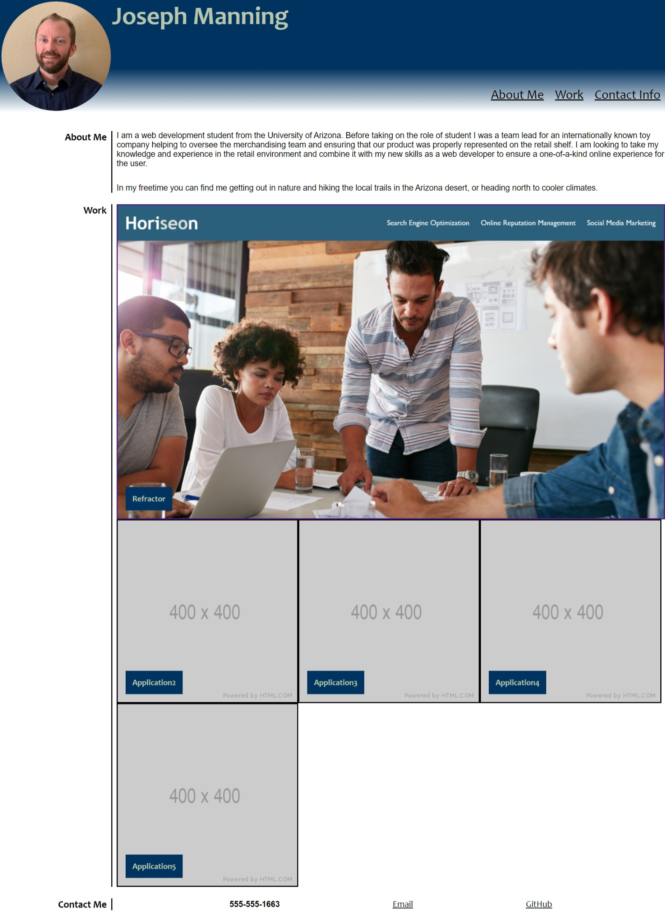

# Portfolio
---

## Description

In this homework assignment, you will find the portfolio that I will use to upload my completed projects.  My initial application showcases my ability to refactor code.

---

## Image

Below is an image of my completed portfolio page.

---

## Resources

I utilized the following sites to assist in creating my portfolio webpage.
* https://www.w3schools.com/
* https://css-tricks.com/
* https://www.w3docs.com/

---

## Application

You can find my portfolio page at the following:

* https://jman4342.github.io/Portfolio/
